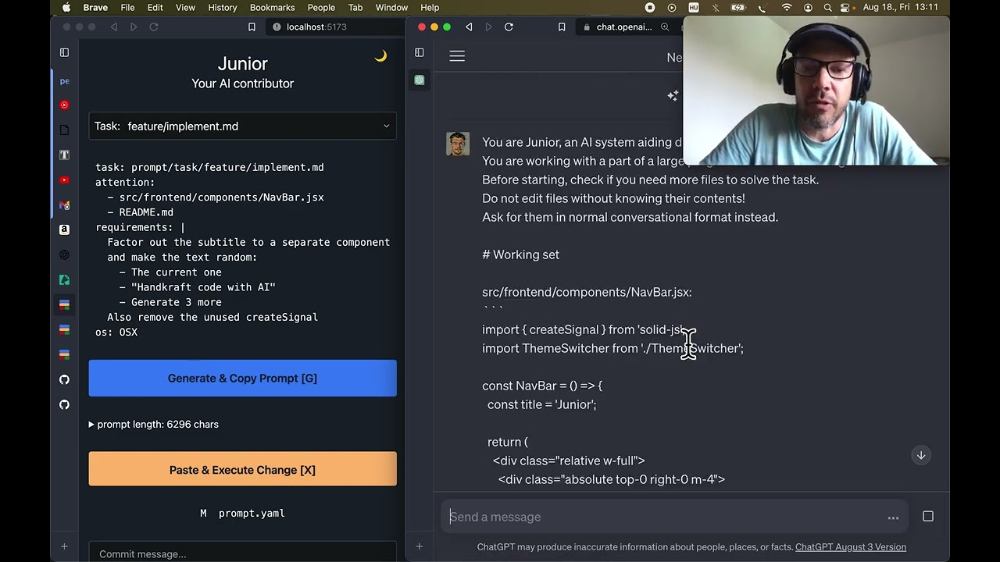

[](https://tisztamo.github.io/Junior/#/)

# Junior - AI-First IDE which fully writes its own code

[](https://youtu.be/NL4uFJSvfW0)

*"Video: Junior codes itself"*

## Read-Code Environment

The future of coding is AI. Humans will rarely interact directly with the source code; instead, it will be generated by language models. This shift promises to significantly boost developer productivity and, hopefully, enhance the joy of programming. However, human oversight will remain necessary for the foreseeable future. We will supervise the work of the LLM, providing inputs such as business needs and strategic/architectural directions, and reviewing the generated code.

This introduces a completely new way of interacting with the codebase, and it also requires a rethinking of the user interface. 'Junior' is an attempt at addressing this.

Junior is not only AI-first but also mobile-first, although it still lacks some features to be truly usable on mobile.

## Can LLMs Handle Large Codebases?

My original question was whether Large Language Models (LLMs) could manage extensive codebases. The key challenge is the model's context window, or its "Working Memory." This limitation means we couldn't fit an entire source code into the prompt, necessitating a way to selectively focus on relevant code segments for each editing task.

Surprisingly, the answer turned out to be yes. Early in its development, even without all essential features, Junior began self-coding. It started by generating a console prompt from a YAML file containing my English commands and a list of files and directories. I then manually transferred this into ChatGPT, saved the output as a shell script, and executed it. This process allowed Junior to edit and refine its own code, adding new features and performing refactorings. The moment it successfully modified its code was a revelation to me. Impressively, Junior entirely developed its web interface, including both backend and frontend.

## Getting Started

```sh
npm install -g @aijunior/dev
mkdir junior-tryout
cd junior-tryout
junior
```

* Note: Junior is a research project at this time, not production ready. *

For more info read the docs at https://aijunior.dev

## Contributing and Support

Your contributions make a difference! At Junior, we value the collaboration of the community. Your role as a contributor is to monitor the development, provide detailed prompts, and thoroughly review the generated outcomes.

For support, please create an issue in the GitHub repository.

**Note:** For meaningful results, it's recommended to use the GPT-4 model or a more recent version.
