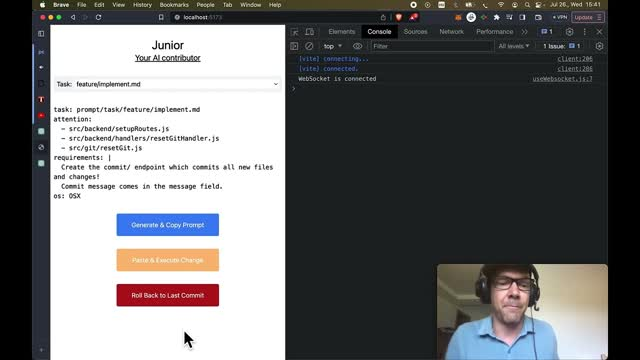

# Working set

doc/roadmap.md:
```
# Roadmap
## Usability & fixes
- Details here

## Programming on mobile
- Details here

## Auto-attention
- Details here

## Prompt-herd refactors
- Details here

```

README.md:
```
Warn: This README is AI generated, just like all the source files of this project.

# Junior - Your AI contributor which writes itself.

[](https://www.youtube.com/watch?v=W_iwry8uT7E)

*"Video: Junior codes itself"*
## Description

Junior is an exploratory project aimed at revolutionizing the way programmers interact with the development process. Just like how Linus Torvalds oversees the Linux Kernel development without coding himself, this project allows developers to communicate with the AI and supervise the development process.

Isn't that already possible with ChatGPT? No, LLMs have very limited "working memory", so it is not possible to directly work with them on large codebases.

By providing specific task details in a prompt descriptor and highlighting the relevant parts of your project, you can delegate code implementation, documentation, testing, and more to your AI Junior.

## Getting Started

### Installation

To install, clone the repository and run `npm install` in the root directory.

### Usage

There are two ways to use this project: a command-line interface (CLI) and a web interface.

#### Command-line interface (CLI)

To start the CLI, use `npm run cli`. This mode uses the ChatGPT API, and you'll need an API key stored in the `OPENAI_API_KEY` environment variable.

#### Web Interface

Run the application with `npm start` to start a local server, where you can generate a prompt and automatically copy it to paste into ChatGPT. The web interface is designed for use with ChatGPT Pro and doesn't require an API key. For more information about the web interface, please refer to [doc/web.md](doc/web.md).

### The Prompt Descriptor

A prompt descriptor is a YAML file (`prompt.yaml`) outlining the details necessary for generating a task prompt for the AI model.

Here's an example of a prompt descriptor:

```yaml
task: prompt/task/feature/implement.md
attention:
  - src/interactiveSession/startInteractiveSession.js
  - src/prompt/createPrompt.js
  - src/attention/readAttention.js
  - prompt.yaml
requirements: >
  Write a README.md for this _exploratory_ project!
format: prompt/format/new_file_version.md
```

Each element in the descriptor serves a specific purpose:
- `task`: Describes the task type and scope. For example, `feature/implement`, `bug/fix`, or `refactor/`. You can check out the [prompt/task/feature/implement.md](prompt/task/feature/implement.md) file as an example.
- `attention`: Lists the files and directories most relevant to the task.
- `requirements`: Describes the actual task in a human-readable format.
- `format`: Determines how the output will be formatted.

### Attention Mechanism

The attention mechanism guides the AI model by providing it with a working set. It helps overcome the limited working memory of large language models.

The working set is a subset of the entire project that's currently in focus. It includes both files and directories. For files, the content is directly provided to the AI. For directories, a brief list of files and subdirectories within them is presented.

## Contributing and Support

Contributions are welcome! Remember, we eat our own dog food in this project. Junior is designed to write itself. Your main role will be to oversee the work, provide detailed prompts, and review the outcomes.

For support, please create an issue in the GitHub repository.

**Note:** For meaningful results, it's recommended to use the GPT-4 model or a more recent version.

```


# Task

Improve the documentation!

Improve the roadmap!
Usability &amp; fixes details: We will implement the four buttons and fix every major bug and write docs to allow using Junior for developing external projects.
Programming on mobile: We need a file browser to allow the user to select attention files from mobile. Then we will create an app by wrapping the frontend and test it by developing at the local Playground and while commuting.
Auto-attention: Based on the requirements and task the user selected, we will propose an attention. We need to embed every file in the project and store the embeddings in an (embedded) vector database
Prompt-herds (rename it!): Prompt herds will scan and transform (refactor) the codebase gradually
Do not change the readme, just read it!


# Output Format

Encode and enclose your results as ./change.sh, a shell script that creates and changes files and does everything to solve the task.
Files are small, prefer heredoc-ing full files using 'EOF' to prevent substitution.

OS: OSX

Installed tools: npm, jq


Do NOT write any text outside the script!

EXAMPLE START

```sh
#!/bin/sh
set -e
goal=[Task description, max 7 words]
echo "Plan:"
echo "1. [...]"
[Commands solving the task]
echo "\033[32mDone: $goal\033[0m\n"
```

EXAMPLE END

